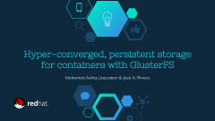

#gluster-kubernetes Presentations

This directory contains slides and links to presentations about the work in the
gluster-kubernetes project.

## 2017.01-02: DevConf.cz 2017 and FOSDEM 2017

[Ashiq](https://github.com/MohamedAshiqrh) and [Jose](https://github.com/jarrpa)
traveled to Brno, CZ and Brussels, BE to give an overview presentation on
hyper-converged GlusterFS on Kubernetes and demo the gk-deploy tool.

* **DevConf.cz 2017**

  **Slides:** 

  NOTE: The slides used for DevConf were a somewhat incomplete version of the
  ones seen at FOSDEM. ;)

  **Video:** [DevConf.cz 2017 presentation](https://youtu.be/DGuP38tAh48?t=5m12s)

* **FOSDEM 2017**

  **Main talk (slides and video):** [Hyper-converged, persistent storage for containers with GlusterFS](https://fosdem.org/2017/schedule/event/glustercontainer/)

  **Lightning talk (slides and video):** [Kubernetes+GlusterFS: Lightning Ver.](https://fosdem.org/2017/schedule/event/kubegluster/)

## 2017-03-23 [vault](http://events.linuxfoundation.org/events/vault/)

[Michael](https://github.com/obnoxxx) presented on gluster-kubernetes at the
vault conference in Cambride, MA.

* **slides**: [Gluster in Kubernetes](2017-03-vault/Gluster-in-Kubernetes.pdf)
* **demos**:
  * gk-deploy: [online](https://asciinema.org/a/5apn5yv7rryqa0hpjozq0s06v) [download](2017-03-vault/demo-deploy.json)
  * heketi: [online](https://asciinema.org/a/9cluxpf9weuyq6oqhmd3v7r0c) [download](./2017-03-vault/demo-test-heketi.json)
  * dynamic provisioning: [online](https://asciinema.org/a/amyldm9lp8sxfqc89eogymx0x) [download](./2017-03-vault/demo-dynamic-provisioning.json)

